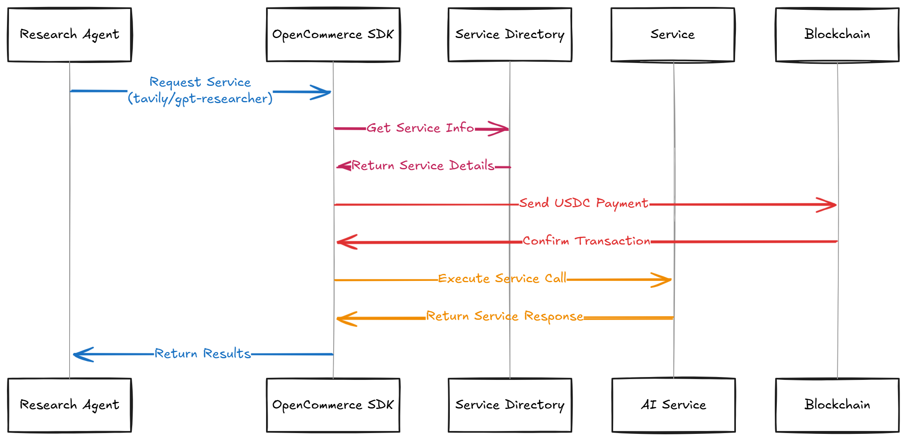

# OpenCommerce SDK Integration with CrewAI

OpenCommerce is a payment network designed for AI agents, enabling them to pay for services in real-time. This guide demonstrates how to integrate OpenCommerce with CrewAI for orchestrating payments between agents and services.

⚠️ **Important**: OpenCommerce SDK is currently in development and only supports testnet operations. Mainnet support will be added in future releases.



## Key Features
- **Pay-as-you-go Services**: Agents can access and pay for AI services in real-time
- **Built-in Account Management**: Automatic account creation and balance management
- **Service Directory**: Centralized directory of available AI services
- **Blockchain-based Payments**: Secure transactions using USDC on Base network

## Quick Start

### 1. Install Dependencies
```bash
pip install opencommerce-sdk crewai
```

### 2. Set Up Environment Variables
Create a `.env` file in your project root:
```bash
OPENAI_API_KEY=your_api_key_here
```

Then load it in your Python code:
```python
from dotenv import load_dotenv
load_dotenv()
```

### 3. Initialize OpenCommerce SDK
```python
from opencommerce_sdk import OpenCommerceAccountToolkit

# Initialize the SDK
sdk = OpenCommerceAccountToolkit(network="testnet")
print("✅ SDK initialized successfully")

# Get the account address
address = sdk.get_account_address()
print(f"My account address: {address}")
```

### 4. Create Tools for Services
```python
class TavilySearchTool(BaseTool):
    name: str = "Tavily Search"
    description: str = "Search the internet for information using Tavily"
    
    def _run(self, query: str) -> str:
        return self.sdk.use_service('tavily_search', {'query': query})

class GPTResearchTool(BaseTool):
    name: str = "GPT Research"
    description: str = "Conduct detailed analysis using GPT Researcher"
    
    def _run(self, query: str) -> str:
        return self.sdk.use_service('gpt_researcher', {'query': query})
```

### 5. Create Agents with Payment Capabilities
```python
market_research_agent = Agent(
    role="Market Research Specialist",
    goal="Gather comprehensive market data",
    tools=[TavilySearchTool(sdk)],
    verbose=True
)

tech_analysis_agent = Agent(
    role="Technology Analyst",
    goal="Analyze technological developments",
    tools=[GPTResearchTool(sdk)],
    verbose=True
)
```

## How It Works

1. **Agent Request**: Agent requests a service (e.g., Tavily search or GPT research)
2. **Service Directory**: OpenCommerce gets service details and pricing
3. **Payment**: SDK handles USDC payment on Base network
4. **Service Execution**: After payment confirmation, service is executed
5. **Results**: Service results are returned to the agent

## Example Use Case

The included example demonstrates a market research workflow where:
- Market Research Agent uses Tavily Search for data gathering
- Technology Analyst uses GPT Researcher for analysis
- Each service call is automatically paid for using USDC

For the complete example implementation, see the full code in this repository.

## Additional Resources

For more detailed information about the OpenCommerce SDK, including:
- Complete API documentation
- Additional code examples
- Service directory details
- Contribution guidelines

Visit the [OpenCommerce SDK GitHub Repository](https://github.com/OpenCommerce-xyz/opencommerce-sdk).

## Funding Options

Currently, OpenCommerce SDK only supports testnet operations for development and testing purposes.

### Getting Test USDC

1. Visit the [Circle USDC Faucet](https://faucet.circle.com/)
2. Select Base Sepolia network
3. Request test USDC tokens

To check your balance:
```python
# Get current balance
balance = sdk.get_balance()
print(f"Current balance: {balance} USDC")
```

